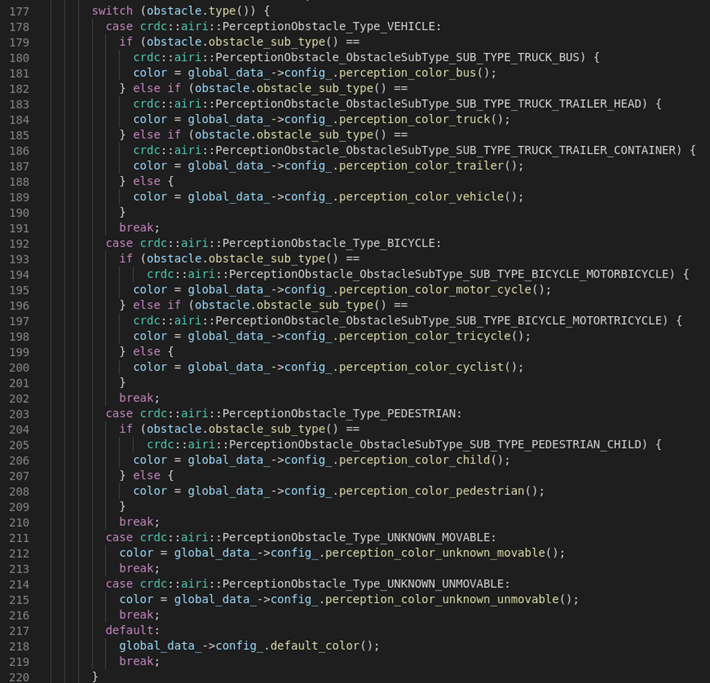

## Description

* It is a very useful perception visualization tools based on CyberRT （as the middleware）.
* Use the project [apollo_cyber](https://github.com/FengD/apollo_cyber) to install the extra perception and sensor .proto.

## Dependencies

``` shell
sudo apt-get install qt5-default
sudo apt-get install qtbase5-dev
sudo apt-get install libqt5charts5-dev
sudo apt install libftgl-dev
sudo apt install libboost-dev
sudo apt install libglm-dev
sudo apt install libavcodec-dev
sudo apt install libswscale-dev
```

## Build

* Set env for different platform
`export PLATFORM=X86`  `export TAG=1604`  `export TAG=1804` for X86

`./build.sh` build the project.
`./build.sh clean` clean the build.
run `./build.sh help` to see the details.


## Release
* If the build successed, all the release are in the `build_dist` folder.

## Use
* Go to the `cd ./build_dist/crdc_airi_common/viewer/bin/`
* Set `export CYBER_PATH=[cyber_install_path]` & `export LD_LIBRARY_PATH=../../lib/`
* Execute `./run.sh`

## Help menu
./build.sh help

```
Usage:
    ./build.sh [OPTION]

Options:
    all: run all
    build: run the code build
    clean: clean the code build
```

## Screen Details


```
The buttons from left to right are:

1. Information window;
2. Return to origin;
3. Add an image display channel (right-click to drag the window, supports up to 6 channels);
4. Delete an image display channel;
5. Measure distance or select coordinates;
6. Save the current interface as an image;
7. Save the current interface as a video;
8. Right-side information window pop-up button.

```


* import & export the configuration


* View settings


* Context Grid settings


* Frame settings


* Subscribed Topics settings


* Demo example:


## Custom Configuration

* Currently, the bbox supports the display of 13 categories, which are: car, bicycle, pedestrian, unknown moving object, unknown stationary object, bus, child, motorcycle, tricycle, trailer, truck head, cone, and fence. The icons and names are shown in the image below. The icons can be modified by defining the obstacle categories, and the color of the boxes can be changed by modifying the configuration file. Specific category information can be found in the source code perception_renderer.cc lines 177-220 as shown in the image below. You can configure it by defining the correct obstacle type and PerceptionObstacle_ObstacleSubType.


* The obstacle colors could be defined by yourself in the prototxt.




## Enjoy


